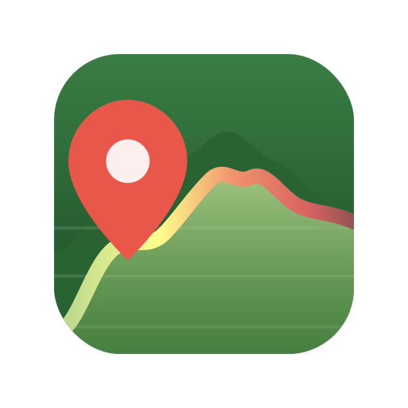

#  GPX Track Planner

A desktop application for planning GPX tracks, specifically in mountainous terrain: view elevation profiles, apply smoothing filters, and estimate travel times with realistic speed models for both hiking and road cycling.

## Overview

Often, elevation profiles in GPX tracks created with mapping software, such as Garmin BaseCamp, appear noisy due to inaccuracies in the underlying map and the digital elevation model. While more or less unavoidable, the noise severely affects estimates based on elevation profiles, such as ascent/descent or travel time along the track.

To this end, this application provides the means to first apply smoothing filters to the elevation profile and second apply a speed model to estimate travel time given the smoothed elevation profile.

While the application provides the core functionality for applying smoothing filters and speed models, their concrete implementations as well as export functions are highly customisable through a plugin system (see below).

## Usage

The application is written in Python using PyQt6. For macOS and Windows, we provide packages on the Releases page that include their own Python environment with all the necessary modules. The packages are not digitally signed; hence, expect to see a warning upon first opening them.

Alternatively, and particularly for development, the application can also be run directly in a given Python environment. For that, ensure you are running Python 3.14 and that all necessary packages are installed (see `requirements.txt`).

### Plugins

The application's functionality can be extended using custom filters, speed models, and export functions. In addition to the basic ones bundled with the releases, we provide others that might serve as examples in this repository. To use them, these have to be placed in their respective directories (`filters` for smoothing filters, `speed_models` for speed models, and `exporters` for export functions) in the user's configuration directory, `~/Library/Application Support/GPX Track Planner/plugins` on macOS and `~\AppData\Local\GPX Track Planner\plugins` on Windows.
